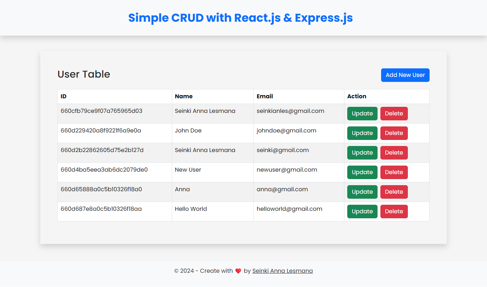

# Simple CRUD with React and Express.js

This is a simple CRUD application using React and Express.js. It is a full-stack application that includes both frontend and backend parts.
This is a simple example of how to create a CRUD (Create, Read, Update, Delete) application using [React](https://react)
And also this project was created to enhance my programming skills in the MERN stack ([MongoDB](https://www.mongodb.com/), [Express.js](https://expressjs.com/), [React](https://react), [Node.js](https://nodejs.org/en)). I hope you like it :)

## Table of Contents

- [Introduction](#introduction)
- [Backend](#backend)
  - [Installation](#backend-installation)
  - [Usage](#backend-usage)
  - [Dependencies](#backend-dependencies)
- [Frontend](#frontend)
  - [Installation](#frontend-installation)
  - [Usage](#frontend-usage)
  - [Dependencies](#frontend-dependencies)
- [Contributing](#contributing)
- [License](#license)

## Introduction

This application is a simple CRUD (Create, Read, Update, Delete) application using React and Express.js. It is a full-stack application that includes both frontend and backend parts.

## Backend

### Installation

To install the backend, follow these steps:

1. Clone this repository
2. Navigate to the project directory
3. Run `npm install` or `yarn install`

### Usage

To start the server, run `npm run server` or `yarn server`. The server will be running on `http://localhost:3001`.

### Dependencies

This project uses the following dependencies:

- Express.js: ^4.19.2
- Mongoose: ^8.2.4
- Dotenv: ^16.4.5

## Frontend

### Installation

To install the frontend, navigate to the `client` directory and run `npm install` or `yarn install`.

### Usage

To start the development server, run `npm run dev` or `yarn dev`. The frontend will be running on `http://localhost:3000`.

### Dependencies

This project uses the following dependencies:

- React: ^18.2.0
- React Bootstrap: ^2.10.2
- React Router: ^6.22.3
- SweetAlert2: ^11.10.7
- Vite: ^5.2.0
- Axios: ^1.6.8
- Bootstrap: ^5.3.3
- Use Local Storage State: ^19.2.0

## Contributing

Contributions are always welcome! If you find any bugs or have any feature requests, please create an issue or submit a pull request.

## License

This project is licensed under the MIT License. See the [LICENSE](LICENSE) file for details.
